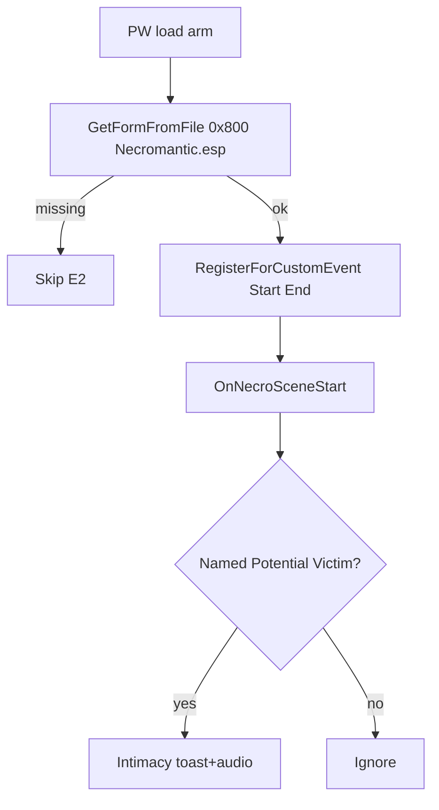

# Slice E — named kill voice + soft Necromantic intimacy

**Implemented** in PSC + ModConfig. Roadmap Slice E items checked.

## Status

- **E1**: `MaybeSpeakNamedKillVoice` on `ProcessKnifeKill` when `GetVictimOverrideName` + `namedKillToast`. Audio key commented until `.xwm` exists.
- **E2**: soft `RegisterNecromanticSceneEvents` on init/load; `OnNecroSceneStart` → `namedIntimacyToast`. Corpse = `akArgs[1] as Actor`.
- **E3**: `OnNecroSceneEnd` → `namedIntimacyEndToast` via same `MaybeSpeakNamedIntimacyVoice(partner, toast, audio)`.

## E1 — Named-victim kill voice

On a **valid blade kill** (Slice B path unchanged for satiation / filters):

- If `GetVictimOverrideName(victim)` is non-empty → special toast + optional audio instead of generic praise.
- Config in `Data/PickmansWhisper/config/ModConfig.txt`:

```ini
namedKillToast={name} is yours forever now.
namedKillAudio=NamedKill.xwm
```

- Missing keys → fall back to generic praise. Key set but xwm/SNDR missing → fail loud.
- Honor `IsVoiceWeaponReady` + `iVoiceDelivery`.

## E2 — Soft Necromantic intimacy (CustomEvent contract)

### Register (soft)

```papyrus
NecromanticMainQuestScript necro = Game.GetFormFromFile(0x00000800, "Necromantic.esp") as NecromanticMainQuestScript
If necro
	RegisterForCustomEvent(necro, "OnNecroSceneStart")
	RegisterForCustomEvent(necro, "OnNecroSceneEnd")
EndIf
```

- No `Necromantic.esp` master. Compile against a **minimal stub** (`CustomEvent` declarations only).
- Missing plugin → skip quietly.

### Behavior

- `OnNecroSceneStart`: `akArgs[1]` corpse Actor + `GetVictimOverrideName` set → ModConfig intimacy toast + audio (throttled).
- `OnNecroSceneEnd`: clear in-scene latch; `akArgs[10]` = completed.
- Payload: gen, corpse, formId, name, hexId, craving, unlocked, sated, witnesses, positionId, completed.

```ini
namedIntimacyToast=She's with you... but she belongs to the blade.
namedIntimacyAudio=NamedIntimacy.xwm
```

- No AAF code in this mod. Knife-voice only.



## Out of scope

- Randomized named-kill banks (later)
- Mastering Necromantic / AAF
- Changing valid kill targets
- Slow hunger (Slice F)

## Verify

1. Name via MCM Victims → blade-kill → named kill line.
2. Unnamed valid kill → normal praise.
3. Necromantic absent → no E2 errors. With scene + named partner in args → intimacy line once per throttle.
