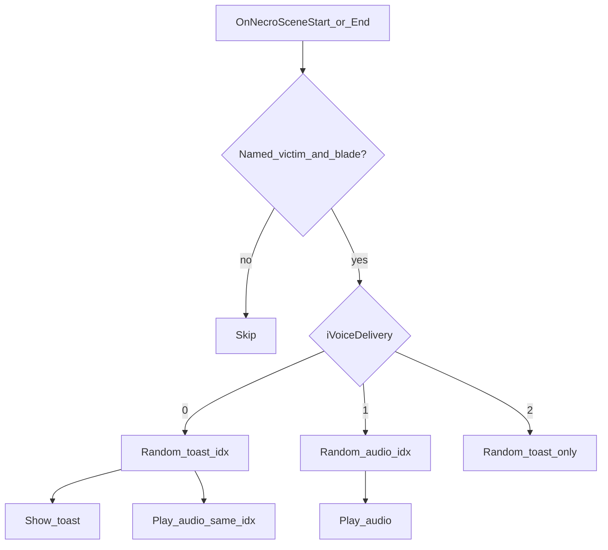

# Slice E — named kill voice + soft Necromantic intimacy

**Implemented** in PSC + ModConfig + audio maps. Roadmap Slice E items checked.

## Status

- **E1**: `MaybeSpeakNamedKillVoice` on `ProcessKnifeKill` when `GetVictimOverrideName` + `namedKillToast`. Audio key commented until `.xwm` exists.
- **E2**: soft `RegisterNecromanticSceneEvents` on init/load; corpse = `akArgs[1] as Actor`.
- **E3**: shared intimacy speaker for Start/End (now `MaybeSpeakNamedIntimacyEvent`).
- **E4**: random Named toast banks under `config/necromantic/` (`Intimacy_Start_Named.txt` / `Intimacy_End_Named.txt`).
- **E5**: parallel `Intimacy_*_Audio.txt` (23+23 relative `.xwm` under `Sound/PickmansWhisper/Necromantic/Start|End`); same-index `iVoiceDelivery` like notice D1.

## E1 — Named-victim kill voice

On a **valid blade kill** (Slice B path unchanged for satiation / filters):

- If `GetVictimOverrideName(victim)` is non-empty → special toast + optional audio instead of generic praise.
- Config in `Data/PickmansWhisper/config/ModConfig.txt`:

```ini
namedKillToast={name} is yours forever now.
namedKillAudio=NamedKill.xwm
```

- Missing keys → fall back to generic praise. Key set but xwm/SNDR missing → fail loud.
- Honor `IsVoiceWeaponReady` + `iVoiceDelivery`.

## E2 — Soft Necromantic intimacy (CustomEvent contract)

### Register (soft)

```papyrus
NecromanticMainQuestScript necro = Game.GetFormFromFile(0x00000800, "Necromantic.esp") as NecromanticMainQuestScript
If necro
	RegisterForCustomEvent(necro, "OnNecroSceneStart")
	RegisterForCustomEvent(necro, "OnNecroSceneEnd")
EndIf
```

- No `Necromantic.esp` master. Compile against a **minimal stub** (`CustomEvent` declarations only).
- Missing plugin → skip quietly.

### Behavior (E4/E5)

- `OnNecroSceneStart` / `OnNecroSceneEnd`: named Potential Victim corpse in `akArgs[1]` → `MaybeSpeakNamedIntimacyEvent(corpse, abStart)`.
- Banks (files-only):
  - `Intimacy_Start_Named.txt` + `Intimacy_Start_Audio.txt`
  - `Intimacy_End_Named.txt` + `Intimacy_End_Audio.txt`
- Delivery mirrors notice D1 via `iVoiceDelivery` (0 toast+audio same index / 1 audio only / 2 toast only).
- Retired ModConfig keys: `namedIntimacyToast` / `namedIntimacyEndToast` / `namedIntimacyAudio`.
- No AAF code in this mod. Knife-voice only.



## Out of scope

- Randomized named-kill banks (later)
- Mastering Necromantic / AAF
- Changing valid kill targets
- Slow hunger (Slice I)

## Verify

1. Name via MCM Victims → blade-kill → named kill line.
2. Unnamed valid kill → normal praise.
3. Necromantic absent → no E2 errors.
4. Voice delivery Toast+Audio → scene start/end: toast + matching clip.
5. Audio only → clip, no toast; Toast only → toast, no clip.
6. Missing xwm/SNDR → error notification (no silent fallback).
